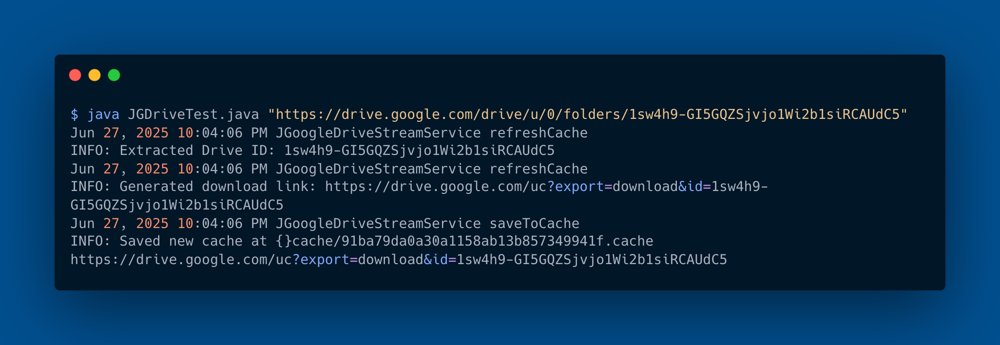

*Generate a Google Drive Video Streaming Link from Any Shared URL*

---

[](https://www.oracle.com/java/)
[](https://junit.org/junit5/)
[](LICENSE)

<a href="https://replit.com/@R4Ajeti/google-drive-streaming-link-generator" target="blank"></a>

👉 [View code snippet on Carbon](https://carbon.now.sh/embed/EeosM6b1Qsyi5GpQHvtr)


### 🚀 Google Drive Link Generator

**google-drive-streaming-link-generator** is a Java utility that converts any Google Drive sharing link into a direct video streaming link. It simplifies the process of embedding or playing videos from Google Drive by generating a clean, streamable video URL from any shared file link.

## Built With

- Java
- JUnit
- Git

## Getting Started [](https://github.com/R4Ajeti/google-drive-streaming-link-generator/actions)

**Running the project**  
Clone the repository to your local machine:

```bash
git clone https://github.com/R4Ajeti/google-drive-streaming-link-generator
cd google-drive-streaming-link-generator
```

Run the program:
```bash
java JGDriveTest.java
```

Compile the Java class:

```bash
javac JGDriveTest.java
```

Run compiled version:

```bash
java -cp . JGDriveTest "https://drive.google.com/drive/u/0/folders/1sw4h9-GI5GQZSjvjo1Wi2b1siRCAUdC5"
```

Replace the example URL with your actual Google Drive sharing link.

```bash
java JGDriveTest.java <google-drive-url>
```

#### OUTPUT

```bash
Jun 27, 2025 8:06:00 PM JGoogleDriveStreamService loadFromCache
INFO: Using cached link for 91ba79da0a30a1158ab13b857349941f.cache (cached 595 seconds ago)
https://drive.google.com/uc?export=download&id=1sw4h9-GI5GQZSjvjo1Wi2b1siRCAUdC5
```

## Authors

👤 **Rinor Ajeti**

- Github: [@r4ajeti](https://github.com/r4ajeti)
- Email: [Gmail](mailto:r4ajeti@gmail.com)
- Twitter: [@r4ajeti](https://twitter.com/r4ajeti)
- LinkedIn: [linkedin](https://linkedin.com/in/r4ajeti)

## 🤝 Contributing

Contributions, issues, and feature requests are welcome!

Feel free to check the [issues page](../../issues).

## Show your support

Give a ⭐️ if you like this project!

## 📝 License

This project is [MIT](https://opensource.org/license/mit/) licensed.

:¨·.·¨: :¨·.·¨: ·. ƮϦαɳk Ψөu .·
